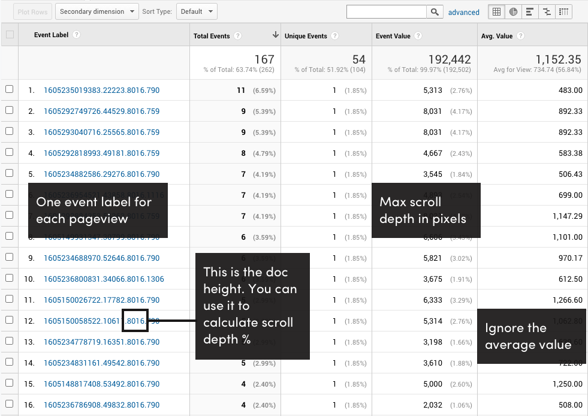

# Scroll Depth 2
Beta version of a better way to measure scroll depth. This is the next version of the original [Scroll Depth](https://github.com/robflaherty/scroll-depth) library.

Intended for people comfortable working with GA data outside of the web UI.

Features and data structure are still in flux.

Feedback welcome!

## What it does
The script generates a unique ID for each pageview and sends the ID as the Event Label. Scroll depth is a pixel value recorded by incrementing the Event Value.

The pageview ID includes the document height, which can be used to calculate the percent of the page scrolled, and the viewport height, which can be used to calculate the number of screens scrolled.

Example:

`1604195775299.26174.8016.744`

`{timestamp}.{random number}.{document height}.{viewport height}`



## Pixel Depth
The script keeps track of the max scroll depth, in pixels, and sends an event when `visibilityState` changes to `hidden` as a way of recording the deepest scroll point when the tab is closed or the user switches tabs. If a user returns to the tab and continues scrolling, the event value is updated the next time `visibilityState` changes to `hidden` again.

## Milestones
Milestones are specified DOM elements that have been scrolled into view, reported as the total number of milestones scrolled into view.

## How to use
```
<script src="scrolldepth.js"></script>
<script>
  scrolldepth.init({
    mode: 'gtag'
  })
</script>
```

## Options
### mode
The only required option is to define the GA implementation. Options are `gtag`, `gtm`, or `universal`.

If using GTM, the dataLayer variables are:
```
 dataLayer.push({
    'event': 'GAEvent',
    'event_category': category,
    'event_action': action,
    'event_label': label,
    'event_value': delta,
    'non_interaction': true
  });
```

### milestones
You can pass a selector list or add the class `.scroll-milestone` to elements that should be treated as milestones. If the latter, you need to turn on milestone tracking by setting the `milestones` option to `true`. Optionally you can specify an offset.

```
<script>
  scrolldepth.init({
    milestones : {
      selectors: ['.first-milestone .another-milestone'],
      offset: 100
    }
  })
</script>
```
### pixelDepth
Pixel depth tracking is turned on by default. If you only want to tracking milestones you can turn off pixel depth tracking by setting `pixelDepth` to `false`.

### sendEvent
You can use this to override the function that sends data to GA with a custom function.

## Notes
- GA4 support coming soon

